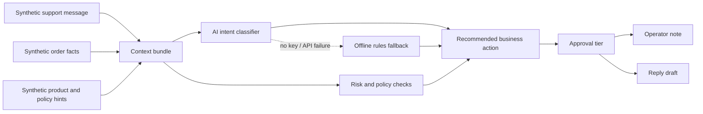

# Architecture

AUVA is framed as an AI-assisted commerce operations layer. This public demo keeps the architecture intentionally small while preserving the important product pattern.

## Public Demo Architecture

## Product Pattern

The full AUVA concept is a commerce-anchored operating intelligence:

1. It sees the store.
2. It sees the conversations.
3. It remembers business policy and customer context.
4. It recommends or drafts actions under human review.

The demo focuses on the smallest public-safe slice: post-purchase support triage.

## AI Integration Boundary

The public demo includes an OpenAI-backed intent classifier in `auva_demo/ai.py`.
When `OPENAI_API_KEY` is available and `AUVA_AI_MODE` is not set to `offline`,
AUVA asks the model for structured JSON:

- `intent`
- `confidence`
- `rationale`

The model is allowed to classify the support case, but it is not allowed to pick
money-moving or fulfillment-changing outcomes directly. Those remain in the
deterministic policy layer:

- `choose_action`
- `approval_tier`
- risk flag generation

That split is intentional. AI interprets messy language; code enforces the
business safety boundary.

## Why Human Review Is Central

Commerce support often touches money, fulfillment, customer trust, policy exceptions, and promises. AUVA should not treat every generated response as safe to send.

The demo therefore routes actions into approval tiers:

- `auto_draft` - low-risk response can be drafted for operator review
- `review_required` - action affects remedy, fulfillment, or customer trust
- `manager_review` - policy explicitly requires higher review

## What Is Synthetic

Everything in this repository is synthetic:

- customer messages
- order facts
- policy hints
- product categories
- evaluation cases

No live merchant data is present.
